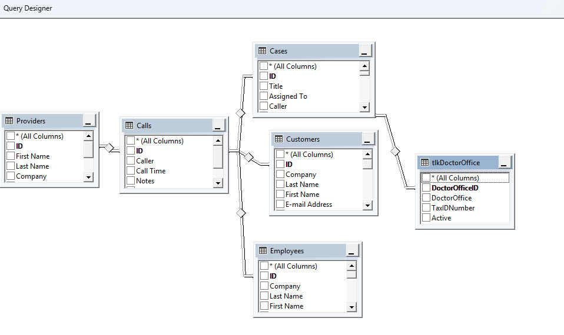
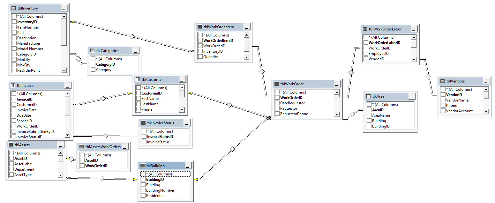
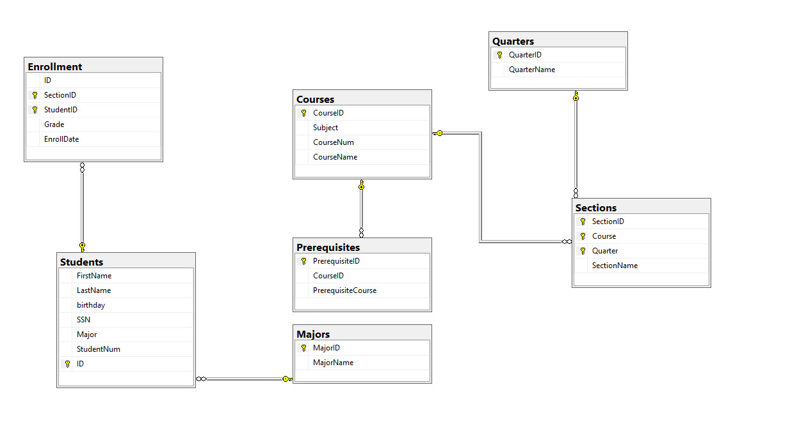
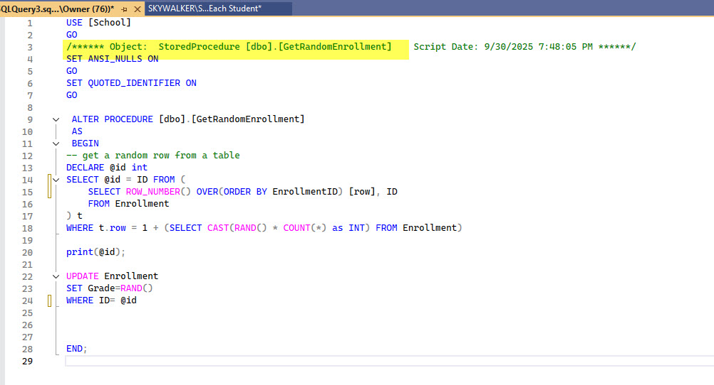
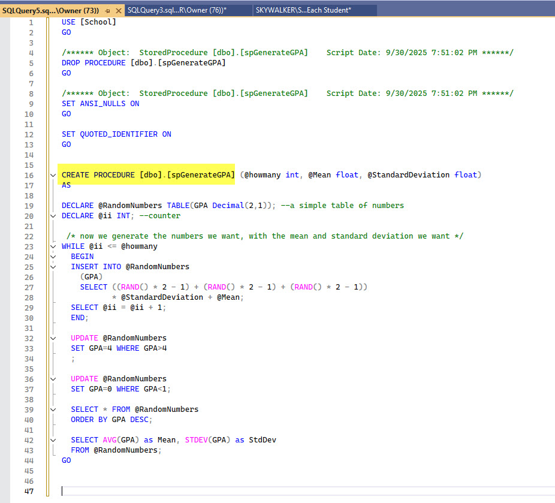
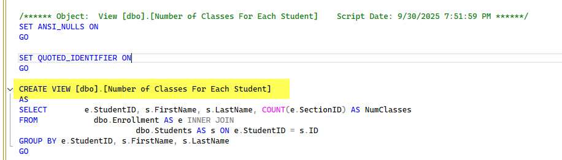

# SQL-Server-Sample
## Sample Screen Shots from SQL Server Projects including E-R diagrams and T-SQL code

## This is from a sample database (ER and code) to keep track of a school's courses, sections, and enrollment

